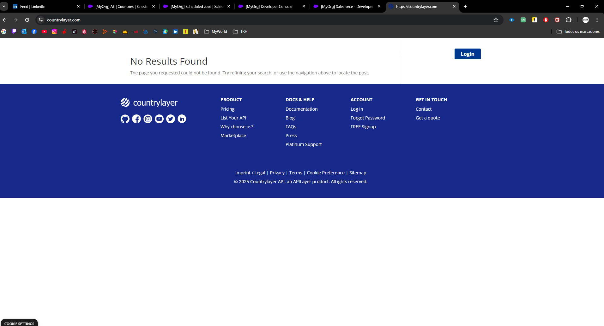
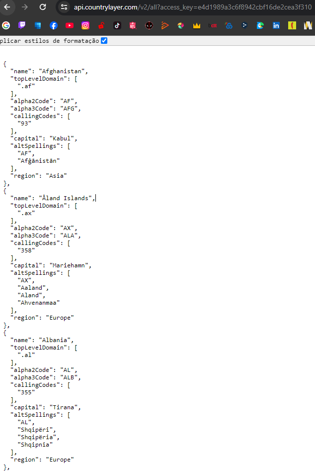

## Solution to the problem:

# 1.

- Register and Login to the CountryLabel API.
- Create a namedCredentials to call the API:
  - Assign NamedCredential permission to System Administrator.
- Create an object in Salesforce with the name Country:
  - Create fields within this object to store the information coming from the API.
- Create an apex schedule:
  - To call the batch 1x a day.
    - Need to create a Schedule Job.
- Create a batch to call the API and execute the desired functionalities.
- Create fields within the Lead object to be populated via the Apex Trigger.
- Create Apex Trigger to populate fields in the Lead object, based on the Lead's country.
- Update the Lead layout to show the functionality.

# Improvements:

- Could have created an Apex Wrapper class to make it easier to read the code and access the variables.

# Missing:

- Create a test class for the batch.
- Create HttpCalloutMock to test the API response.
- Missing the retrive the information from the field regionalBlocs (acronyms).
  - The regionalBlocs parent and child variables (acronyms) do not appear in the API retrieve (check image2).

# 2.

- Create validation rule in Lead object (Not fully tested)

# 3.

- I haven't done anything

## Why didn't I have time to solve the problem?

I had some internet / light problems (Portugal), lack of connection with the api (API 404). Workload throughout the week. Events throughout the week.

